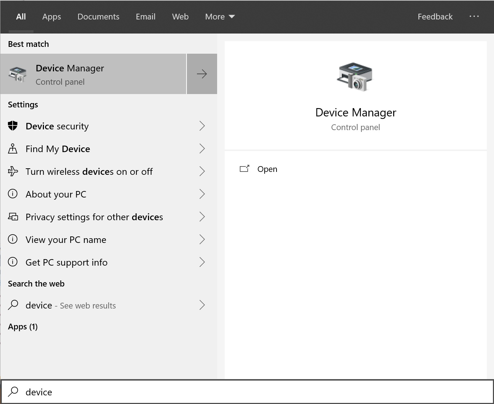
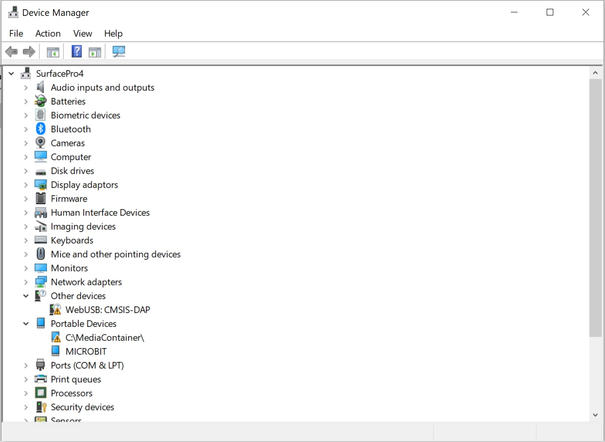
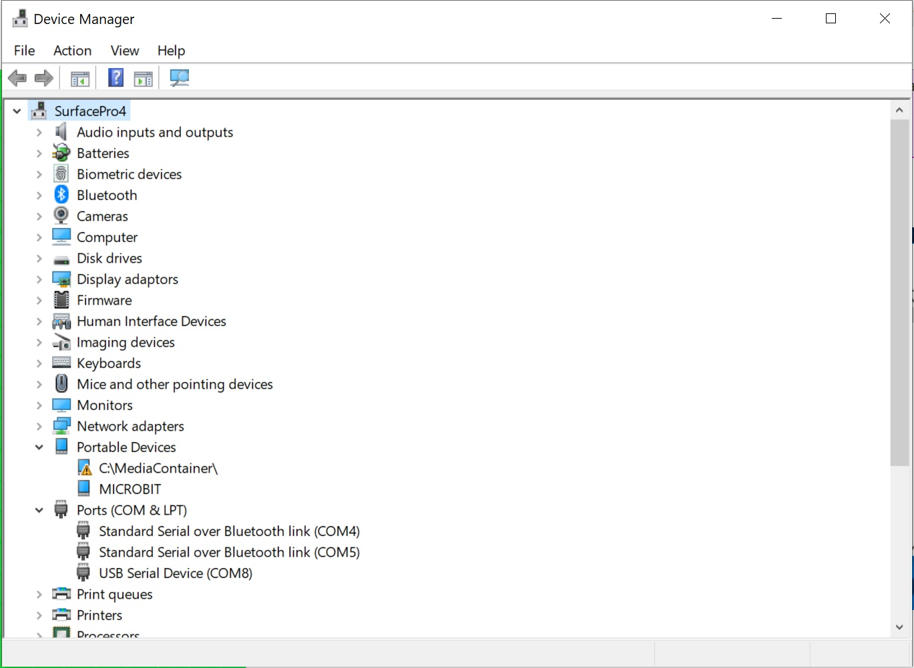
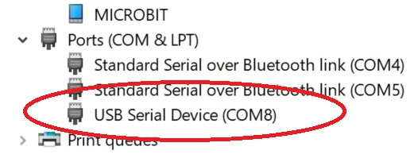

# Hello (Micro:Bit) World! #

## Step 5 - COM Port Setup ##

- We're going to find the serial port number that our Micro:Bit is using.
- Hit the Start Button and type "Device Manager";

    

- Click the "Device Manager" Entry to show the "Device Manager" window;

    

- Expand the "Port (COM & LPT)

    

- In our case, the Port number is "COM8";

    

- Make a note of this number for later!

| Previous | Next |
| -------- | ---- |
| [< Step 4 - Serial Toolbox](4-serial-toolbox.md) | [Step 6 - Pair Micro:Bit >](6-pair-microbit.md) |