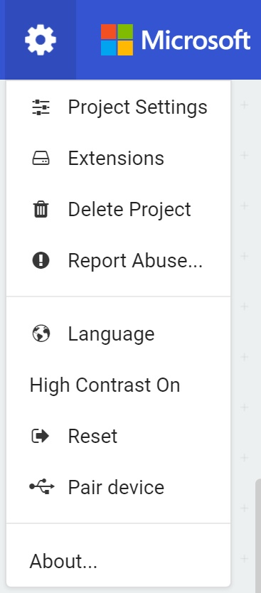
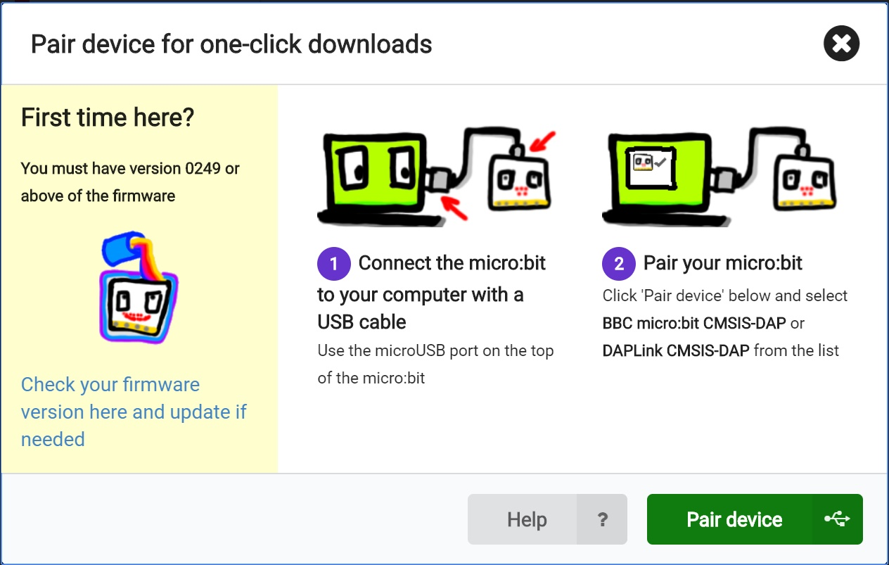
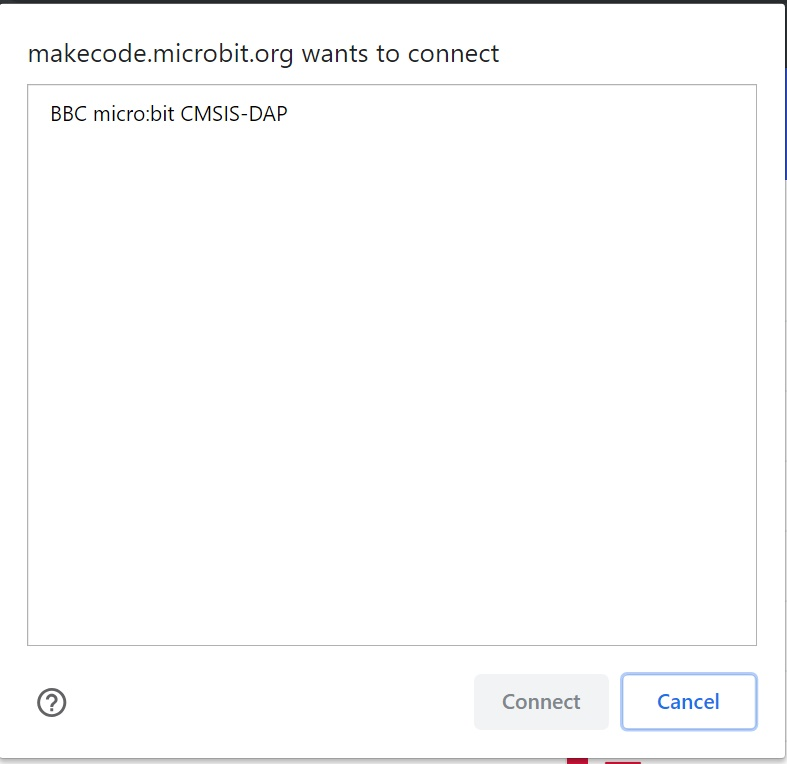
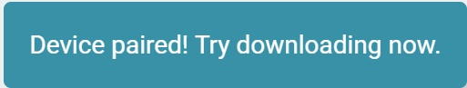

# Hello (Micro:Bit) World! #

## Step 5 - Pair the Micro:Bit to our Browser ##

- We're now going to Pair our Physical Micro:Bit to our browser.
- For this example we'll be using Google Chrome.
- Hit the Settings Cog in the top right hand corener of the screen to show the Settings Menu;

    

- Click the "Pair Device" Menu Item.
- This will show the Device Pairing Help Dialog;

    

- At this stage you'll need to make sure that you have the correct firmware. The best way to do that is to follow the guide on the official Micro@Bit website here;

https://makecode.microbit.org/device/usb/webusb/troubleshoot

- Once you're sure your Micro:Bit is up to date, we can pair our Browser to the Micro:Bit.
- Go ahead and press the "Pair Device" button to show the Device List;

    

- You should see at least one Micro:Bit appear in the list, similair to the list above;
- Click on the Micro:Bit in the list and press the "Connect" button to Pair Your Micro:Bit to your browser.
- You should see a successfully paired notification appear at the bottom of the designer;

    

| Previous | Next |
| -------- | ---- |
| [< Step 5 - Com Port Setup](5-com-port-setup.md) | [Step 7 - Device to PC Comms >](7-device-to-pc-comms.md) |