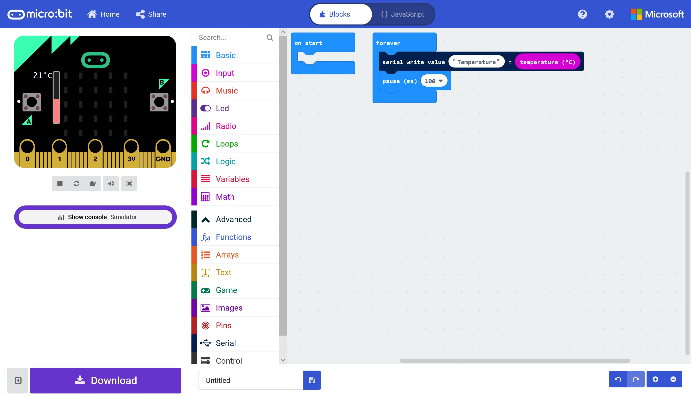
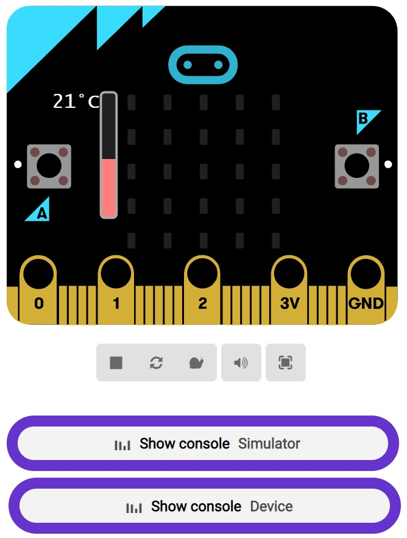
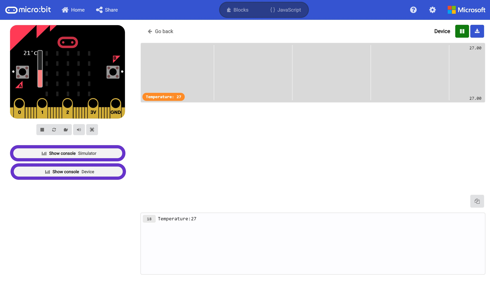
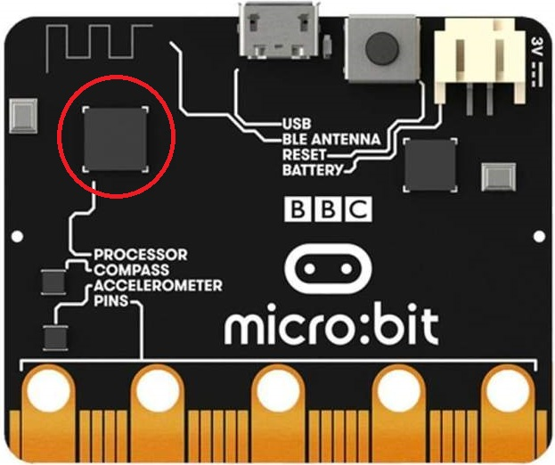
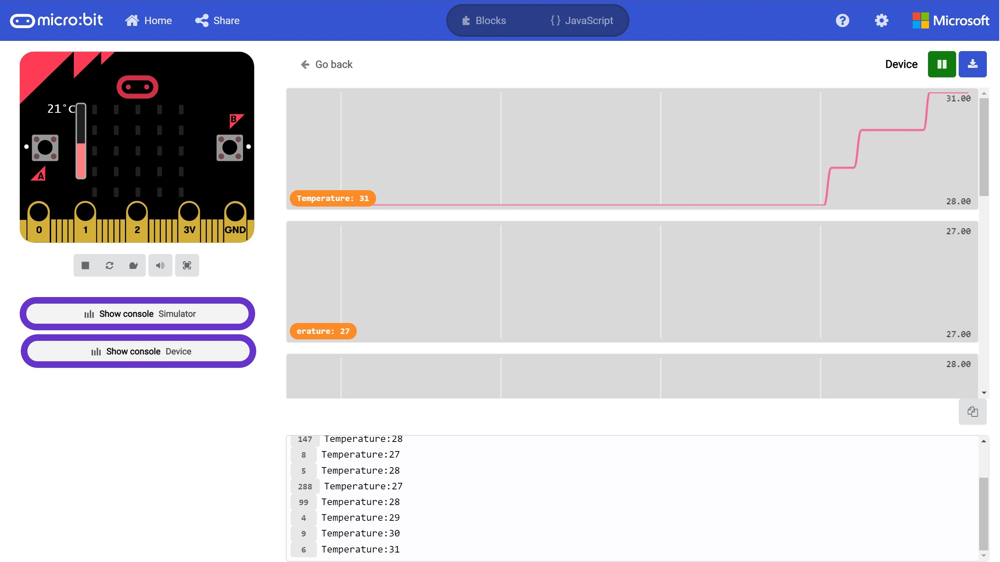

# Hello (Micro:Bit) World! #

## Step 7 - Device to PC Serial Communications ##

- We can now try downloading our code directly to the Micro:Bit.

- You should still have a program similair to the folowing;

    

- Press the Download Button and, if everything has worked, the code should begin Downloading to our Physical Micro:Bit (The orange light on the Micro:Bit will rapidly flash during the download process).
- Once the download is complete and the code runs on the Micro:Bit, you should see that the Simulator has updated, and now shows an extra section - "Show Console Device";

    

- Clicking the "Show Console Device" will show the Device Serial monitor window.

    

- Now press your finger against the Micro:Bit processor here;

    

- You should see the reported temperature from the Physical Micro:Bit go up;

    

| Previous | Next |
| -------- | ---- |
| [< Step 6 - Pair Device](6-pair-device.md) | [Introduction >](/README.md) |