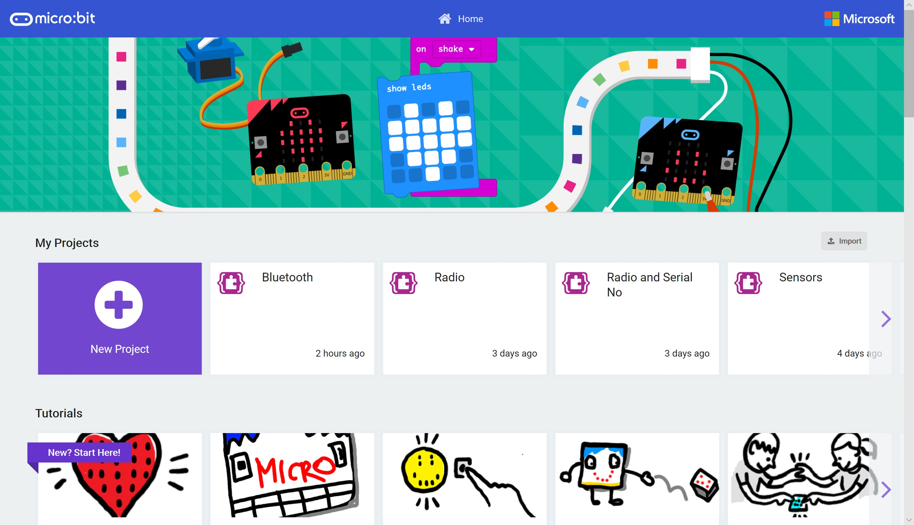

# Serial Communications #

In this section we're going to be connecting our Micro:Bit to our computer and transmitting serial data from the Micro:Bit to the PC.

The Micro:Bit creates a virtual Com Port which can be used to send and recieve Serial Data between devices.

----

## Step 1 - Return to MakeCode ##

- Goto [MakeCode](https://makecode.microbit.org)

    

- You'll notice your "Hello World" (or whatever you called it!) project is now visible.

| Previous | Next |
| -------- | ---- |
| [< Introduction](/README.md) | [Step 2 - New Project >](2-new-project.md) |
